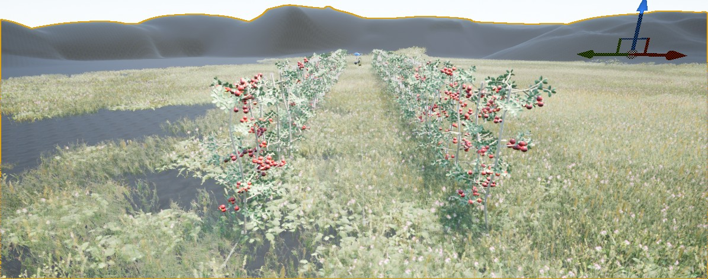

# GANS_Thesis_TU-KL
I am a student of Masters in Intelligent System in TU Kaiserslautern. This repo will contain all the research work related to my thesis in GANs. Before this endeavor, I have worked on a project to create a synthetic dataset. This dataset is used for the Yolo net's training. We had used Unreal Engin for simulation and Blender for 3D models of Sugarbeet plants. These models of sugar beet plants are placed in a simulated Farmland environment. A Camera is attached to a tractor that takes images of sugar beet planted in the soil.  Once the images are collected, I  then use the OpenCV python library for the creation of the dataset. 

Now, we are aiming to use Generative Adversarial Networks (GAN), a Deep learning approach to create an infinite amount of data with some variation. This task requires a deep understanding of such networks and the Maths behind them. There are many state-of-the-art GANs available in the market which can be used to fulfill our purpose. 

## Data Extraction Pipeline

In Kallstatd, Germany, We have visited the local apple orchard farm where we collected the videos through our robot. The ZED depth stereo cameras were used for this tasks. My task was then to design and develop pipeline using OpenCV and ZED toolkit which will extract images of focused objects (apple trees) from .svo files. ZED depth cameras have played huge role for the identification of such area within a frame. 

In this pipeline, first we have resized the frame width and height according to our need than we use Watershed technique for the segmentation since there are many false contours in Binary images.The watershed algorithm is a classic algorithm used for segmentation and is especially useful when extracting touching or overlapping objects in images, such as the coins in the figure above.Using traditional image processing methods such as thresholding and contour detection, we would be unable to extract each individual coin from the image — but by leveraging the watershed algorithm, we are able to detect and extract each coin without a problem.When utilizing the watershed algorithm we must start with user-defined markers. These markers can be either manually defined via point-and-click, or we can automatically or heuristically define them using methods such as thresholding and/or morphological operations.

Based on these markers, the watershed algorithm treats pixels in our input image as local elevation (called a topography) — the method “floods” valleys, starting from the markers and moving outwards, until the valleys of different markers meet each other. In order to obtain an accurate watershed segmentation, the markers must be correctly placed.

  

The above frame is result of watershed algorithm on binary image that already contains depth information. Watershed allows to further enhance the boundary between background and foreground. Once the clear distinction between back/for ground is established we then moved to segmentation. 

  

This is the final image after watershed and segmentation processes. As you can see closely that even the leaves are properly separated from background. This is necessary in image generation through GANs because GANs must observe important portion of image in order to regenerate the it.

After this step, we use OpenCV findContour() function to get the contour of watershed's image and compute the center of largest contour. By using this center we generate Rectangle around the contour. This rectangle is then used to crop the portion out of the raw frames from videos.

  

We have the cropped images which fulfill our demands.

  

## Abstract

Precision farming has observed tremendous impacts in the field of agriculture. Farmers
are trying to exploit these latest A.I and robotic based technologies for increase in the
crop yield. Many companies are competing each other for autonomous vehicular robots
which can automate many human-based tasks in the farming. An autonomous robotics
systems need imaging data in order to train their models for various tasks like classification,
segmentation and tracking. It is challenging to collect imaging data related to the crop
life cycle. This work explores the use of Generative Adversarial Networks (GANs) for
the generation of complex images related to the apple orchard field. The deep generative
model must transfer the spatial information from training images to generated images.
In the training images, there are two sets of images where one set is designed in unreal
engine software and another set contains real images of the apple orchard field. A GAN is
a combination of two neural networks which work in competition with each other for the
construction of the images where one network’s gains are the other network’s losses. GANs
are prone to instability in terms of training and evaluation due to their complexity and
unsupervised learning nature. To subdue this instability, deep cyclic GANs are deployed to
generate data from training images instead of from latent noise. This system automatically
discovers patterns in the training data and emulates them for the generation of new data.
This thesis explores the idea of using GANs for the generation of apple images from
the apple orchard. These are very complex images with a varied distribution of data
amongst them. For the first set of training data collection, two cameras are connected
to an autonomous robot at two different angles that take images of apple trees. For the
second set of training data , an unreal engine is used for the creation of farm like simulated
environment in which 3D models of apple trees are placed to produce 3D images. In the
generation of 3D data through the unreal engine, there is a leverage on the choice of any
settings like lighting, weather, apple size, etc. This allows to map any data from any
domain to the apple tree domain and also transfer the style from synthetic data to target
data. The network is trained on a dataset which is the combination of synthetic data and
real data. The view angle of synthetic images must be set similar to the original image’s
view angle. This allows both datasets to be semantically similar. Several experiments
have been performed with varied environments in synthetic data and an inference score
is calculated for the evaluation of the final results. The trained model of cyclic GANs
can generate countless images apple orchard which can be used as training data for other
agriculture-based machine learning tasks.

## Creation of 3D Dataset
This has been established that under observation GAN architecture requires two datasets
that belong to two domains. One domain can be addressed as a target domain that
contains real segmented images of apple trees and the second domain can be addressed as
a source domain that contains synthetic data designed in Unreal Engine

  

  

  

During the creation of 3D data, it was important to build and design a farm-like environment
to achieve semantic similarity between real images and 3D images. This idea plays a very
important role for the GAN to map the object from one domain to another domain while
keeping the semantic nature of the domains intact. The first task is to create 3D models of
Apple trees which have apples attached to them. The color of apple fruit can be changed
from green to red and this thesis requires to transfer the style from one domain to another
domain. for instance, the red color of 3D apple fruit must be mapped to the green apple
of the real image using GAN. This would allow the creation of any kind of 3D data under
any kind of environment. GAN needs a huge amount of data to generate the new synthetic
data. Once the apple tree model is designed, 3D farm-like environment is created to place
the models of an apple tree in the field. from fig, it can be observed that a 3D vehicle
is created for the locomotion purpose to move between the fields of apple trees and the
unreal engine’s built-in camera tool is utilized for the acquisition of images. These 3d
models of cameras are placed on the vehicle at a similar angle as at a real autonomous
robot vehicle.

  

